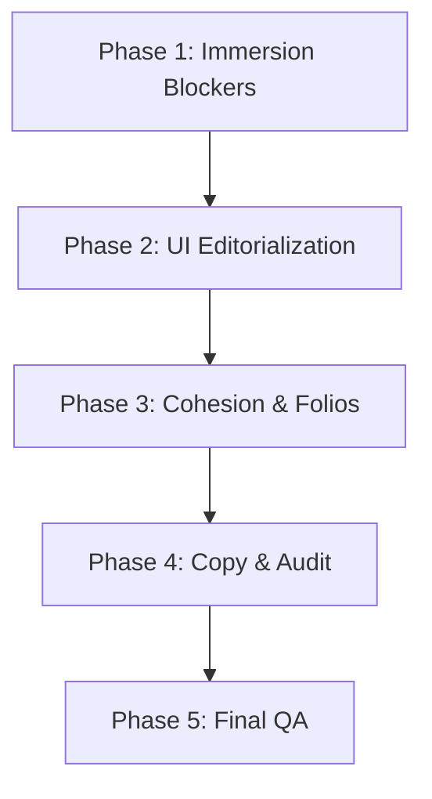

# Editorial Magazine - Top Premium Specification

This specification outlines the Spec-Driven Development (SDD) plan to elevate the
`editorial-magazine` XV invitation theme from "visually improved" to a true **TOP PREMIUM**
editorial magazine experience.

Through a deep audit of the codebase, we have identified several class/selector mismatches, layout
fallbacks, and missing overrides that prevent the preset from fully expressing its high-fashion,
editorial design potential. This document details our findings, design principles, and a
section-by-section remediation plan.

---

## 1. Current State Audit

A real-code inspection of the repository reveals the following architecture, constraints, and bugs:

### CSS Scoping & Selector Bugs

- **Countdown Mismatch**: In `src/components/invitation/CountdownTimer.astro`, the HTML output uses
  classes like `countdown__timer` (double underscore) and `countdown__segment`. However,
  `src/styles/themes/sections/countdown/_editorial-magazine.scss` targets `.countdown-timer` (single
  dash) and `.countdown-timer__segment`. As a result, **no custom styling for the countdown timer is
  currently applied**, falling back to default styling.
- **Location Map Buttons Mismatch**: In `src/components/invitation/components/VenueCard.astro`, map
  buttons use the class `event-location__nav-button`. However,
  `src/styles/themes/sections/location/_editorial-magazine.scss` attempts to style them using
  `.venue-card__nav`, `.event-location__nav-link`, and `.event-location__map-button`. This selector
  mismatch causes the maps/Waze buttons to fall back to the default rounded gray pill buttons
  instead of flat, sharp-edged editorial elements.
- **Header Variant Fallback**: `EventHeader.astro` passes the theme preset (`editorial-magazine`) to
  `HeaderBase.astro` as `variant`. The wrapper renders
  `<header class="header-base" data-variant="editorial-magazine">`. However, there is no
  `_editorial-magazine.scss` file in `src/styles/themes/sections/header/`. Consequently, the header
  falls back to generic styling rather than inheriting the theme's high-contrast black-and-white
  look.

### Layout & Presentation Fallbacks

- **Thank-You Stack Fallback**: In `src/components/invitation/ThankYou.astro`, the
  `editorial-magazine` preset is omitted from the `EDITORIAL_THANK_YOU_VARIANTS` array (lines
  33-36). This forces the component to render the standard stacked layout (`thank-you-content`)
  instead of the beautiful side-by-side split layout (`thank-you-editorial`) reserved for editorial
  presets.
- **Gallery Grid Strategy Mismatch**: In `src/lib/components/gallery/getLayoutClass.ts`, there is no
  layout strategy defined for `editorial-magazine`. It falls back to `STANDARD` (4:5 vertical cards)
  for all images, breaking the promised "doble página editorial" (double-page spread) layout.
- **Guest Pass (PersonalizedAccess) Missing Override**: There is no `editorial-magazine` variant
  file in `src/styles/themes/sections/personalized-access/`. The personalized pass renders using the
  base styling, which features rounded corners, drop shadows, and a decorative gold star SVG,
  looking like a generic web card rather than an editorial backstage ticket or VIP access pass.

### Cover Reveal Photographic Immersion

- `EditorialCoverReveal.astro` does not currently accept an image or portrait prop, rendering a
  solid/gradient overlay (`--ec-bg`) with typography. To make this feel like a true high-fashion
  magazine cover (e.g., Vogue, Harper's), it needs to support displaying the main photograph (e.g.
  `page.viewModel.hero.backgroundImage` or `page.viewModel.hero.portrait`) treated with grayscale,
  grain, and high contrast under/behind the text elements.

---

## 2. Problem Statement

The invitation still feels like a basic web template styled with serif fonts rather than an
immersive, premium digital fashion magazine.

### Visual Composition Problems

- **Lack of Coherent Editorial Rhythm**: Sections stack vertically without any unifying elements
  like folios (running page headers/footers), article credits, page numbers, or thin magazine column
  rules.
- **Mismatched UI Elements**: Generic rounded shapes, thick borders, drop shadows, and app-like
  containers disrupt the print/editorial aesthetic.
- **No Cover Photo**: A solid color cover reveal feels like a modal overlay rather than the opening
  cover of a printed edition.

### Interaction / UI Problems

- **Lack of Layout Immersion**: Sticky headers and mobile floating widgets (WhatsApp, music player)
  visually invade premium full-bleed spreads, reducing editorial immersion.
- **Form-like RSVP**: The RSVP section feels like a database input form rather than a premium,
  limited-edition guest confirmation.

### Content & Narrative Problems

- Spanish copywriting must feel editorial. Generic terms (e.g., "Ubicación", "Familia", "Regalos")
  should be framed as articles or spreads (e.g., "Pase de Acceso", "Elenco Familiar", "Crónica de la
  Jornada", "Guía de Regalos").

---

## 3. Premium Editorial Design Principles

We establish these executable rules for the `editorial-magazine` theme:

1. **Clean Editorial Aesthetic**: Remove generic rounded cards, pill buttons, heavy shadows, and
   app-like containers. Minor border radius is acceptable only where it does not weaken the flat
   print/editorial aesthetic. Use flat paper backgrounds (`#f7f5f2`), deep carbon ink (`#0d0d0f`),
   and pure white.
2. **Restrained Accents**: Use the editorial red (`#d71920`) strictly as an accent (e.g., a single
   key subtitle line, a barcode number, or a hover state). Never use it as a solid background block.
3. **Structured Typographic Hierarchy**:
   - **Masthead/Headlines**: High-contrast serif (`Bodoni Moda` or `Playfair Display`), uppercase,
     tight line-height (`0.75` to `0.85`), with dramatic size contrasts.
   - **Kickers/Labels**: Monospace-like or strict sans-serif (`Instrument Sans`), small size,
     uppercase, wide letter-spacing (`0.18em` to `0.28em`), used for folios, metadata, and footnote
     notes.
   - **Body copy**: Balanced `Instrument Sans` (sans-serif) for high legibility, keeping a clean
     print style.
   - **Calligraphy**: Limit `Pinyon Script` to single words of transition (e.g., _en_, _y_, _de_) in
     sizes that highlight their organic flow.
4. **Cohesive Narrative (Folios & Credits)**:
   - Treat each section as a magazine page. Do not hardcode page numbers unless the section order is
     guaranteed by code. Instead, prefer semantic folios, issue metadata, CSS counters, or
     non-numbered labels (e.g., `CELEBRA-ME | EDICIÓN XV | SECCIÓN INICIO`).
   - Structure groups as columns separated by thin rules (`1px solid rgb(var(--ink-rgb) / 14%)`),
     resembling a masthead credits layout.
5. **Photographic Cohesion & Asset Guardrails**:
   - Apply consistent treatments to all images (high-contrast black and white or muted desaturation,
     thin hairlines) to maintain the editorial print illusion.
   - Do not introduce fake placeholder assets. If image inconsistencies cannot be resolved safely
     with styling filters or crops, document it as an asset/content limitation rather than hiding
     it.

---

## 4. Section-by-Section Remediation Plan

### Cover Reveal / Closed Magazine Cover

- **Current Issue**: Plain gradient background, lacks photographic impact.
- **Desired Premium Direction**: A full-bleed portrait cover photograph styled with
  grayscale/film-grain, with the large masthead text overlapping the subject's portrait.
- **Concrete Implementation Changes**:
  - Modify `src/components/invitation/EditorialCoverReveal.astro` to accept `backgroundImage` and
    `portrait` props.
  - Update **every** rendering path: `src/pages/[eventType]/[slug].astro` and
    `src/pages/dashboard/invitaciones/[id]/preview.astro` to pass the resolved image parameters.
  - Render the image using `<picture>` as a full-bleed layer underneath the text.
  - Adjust `src/styles/invitation/_editorial-cover.scss` to handle absolute positioning of the
    image, film-grain, and typography layouts on mobile.
- **Affected Files**:
  - [EditorialCoverReveal.astro](file:///d:/code/celebra-me/src/components/invitation/EditorialCoverReveal.astro)
  - [\_editorial-cover.scss](file:///d:/code/celebra-me/src/styles/invitation/_editorial-cover.scss)
  - [[slug].astro](file:///d:/code/celebra-me/src/pages/[eventType]/[slug].astro)
  - [preview.astro](file:///d:/code/celebra-me/src/pages/dashboard/invitaciones/[id]/preview.astro)
- **Acceptance Criteria**: The cover displays the hero image in high-contrast desaturated tone;
  typography sits beautifully over it.

### Hero / Opening Spread

- **Current Issue**: Feels like a collage poster; header overlaps awkwardly.
- **Desired Premium Direction**: An opening magazine spread. Left side: large vertical title and
  issue label. Right side: framed portrait photo.
- **Concrete Implementation Changes**:
  - Refine grid layout in `src/styles/themes/sections/hero/_editorial-magazine.scss` to enforce
    clean asymmetry.
- **Affected Files**:
  - [\_editorial-magazine.scss (hero)](file:///d:/code/celebra-me/src/styles/themes/sections/hero/_editorial-magazine.scss)
- **Acceptance Criteria**: Desktop layout splits title and portrait cleanly; mobile layout maintains
  correct vertical stacking with zero text overlap.

### Quote / Editorial Letter

- **Current Issue**: Standard centered text block.
- **Desired Premium Direction**: Looks like an "Editorial Letter" signed by the protagonist,
  utilizing a classic dropped capital letter (Drop Cap) and generous whitespace.
- **Concrete Implementation Changes**:
  - Refine margins and paddings in `src/styles/themes/sections/quote/_editorial-magazine.scss`.
  - Ensure the drop cap behaves correctly. Add a semantic folio line at the bottom.
- **Affected Files**:
  - [\_editorial-magazine.scss (quote)](file:///d:/code/celebra-me/src/styles/themes/sections/quote/_editorial-magazine.scss)

### Guest Pass (Personalized Access)

- **Current Issue**: Renders as a default card with rounded corners and drop shadow.
- **Desired Premium Direction**: A flat, numbered, barcode-styled VIP Access Pass printed on heavy
  paper.
- **Concrete Implementation Changes**:
  - Create `src/styles/themes/sections/personalized-access/_editorial-magazine.scss`.
  - Add `src/styles/invitation-sections/personalized-access/editorial-magazine.scss`.
  - Override `.access-card` to use minor border radius, remove heavy drop shadows, and use thin
    hairline borders.
  - Render a mock decorative barcode and serial number (using only public, demo-safe text like
    `ED-XV · ROBERTA · 2027` or `ED-XV-2027 · ACCESO 04`). Do not use internal database IDs or imply
    scanner backend integrations.
  - Ensure the `VISTA PREVIA DEMO` label is styled as a separate demo/debug badge or minor tag,
    rather than invading the premium editorial pass layout.
- **Affected Files**:
  - [editorial-magazine.scss (presets/sections)](file:///d:/code/celebra-me/src/styles/invitation-sections-by-preset/editorial-magazine.scss)
  - [NEW]
    [\_editorial-magazine.scss (personalized-access)](file:///d:/code/celebra-me/src/styles/themes/sections/personalized-access/_editorial-magazine.scss)
  - [NEW]
    [editorial-magazine.scss (invitation-sections)](file:///d:/code/celebra-me/src/styles/invitation-sections/personalized-access/editorial-magazine.scss)
- **Acceptance Criteria**: The card has no heavy shadow, uses monospace labels, and features a clean
  barcode/serial look.

### Family Intro & Credits

- **Current Issue**: Standard panels that resemble administrative forms.
- **Desired Premium Direction**: A magazine editorial credits page ("Créditos de la Edición").
- **Concrete Implementation Changes**:
  - Style the group elements in `src/styles/themes/sections/family/_editorial-magazine.scss` as list
    columns separated by vertical hairlines.
  - Remove panel backgrounds and outer borders. Use large serif names paired with small uppercase
    labels (e.g., `MADRE / Ana García`).
- **Affected Files**:
  - [\_editorial-magazine.scss (family)](file:///d:/code/celebra-me/src/styles/themes/sections/family/_editorial-magazine.scss)
- **Acceptance Criteria**: No boxed panel borders; names list cleanly in column layouts.

### Gallery ("Doble Página Editorial")

- **Current Issue**: Stacked aspect-ratio cards.
- **Desired Premium Direction**: A double-page photo editorial layout with asymmetric grids,
  overlapping blocks, and permanent typewriter captions.
- **Concrete Implementation Changes**:
  - Add `editorial-magazine` strategy in `src/lib/components/gallery/getLayoutClass.ts` to return
    `FEATURE` for index 0 and `WIDE` for index 3.
  - Style the grid in `src/styles/themes/sections/gallery/_editorial-magazine.scss` using
    `grid-template-columns: repeat(12, minmax(0, 1fr))` on desktop.
  - Set `grid-column: span 12` for `WIDE` (full-bleed spread) and `span 6` for `FEATURE` items.
  - Make captions permanently visible below the photo frame with format `Fig. 01 — Caption`.
- **Affected Files**:
  - [getLayoutClass.ts](file:///d:/code/celebra-me/src/lib/components/gallery/getLayoutClass.ts)
  - [\_editorial-magazine.scss (gallery)](file:///d:/code/celebra-me/src/styles/themes/sections/gallery/_editorial-magazine.scss)
- **Acceptance Criteria**: Gallery renders asymmetric grid on desktop; captions are permanently
  visible and readable.

### Countdown / Save the Date

- **Current Issue**: Segment styling doesn't apply due to a class mismatch (`.countdown-timer` vs
  `.countdown__timer`).
- **Desired Premium Direction**: Flat, block-aligned typography countdown without card frames.
- **Concrete Implementation Changes**:
  - Correct the class selectors in `src/styles/themes/sections/countdown/_editorial-magazine.scss`
    to target `countdown__timer`, `countdown__segment`, etc.
  - Style segments with vertical dividers (`border-right: 1px solid`) instead of outer card boxes.
- **Affected Files**:
  - [\_editorial-magazine.scss (countdown)](file:///d:/code/celebra-me/src/styles/themes/sections/countdown/_editorial-magazine.scss)
- **Acceptance Criteria**: Custom magazine typography (Bodoni Moda) applies to segments; segment
  borders are flat lines.

### Ceremony & Reception Location

- **Current Issue**: Buttons default to rounded pills due to a class mismatch.
- **Desired Premium Direction**: Immersive cards featuring rectangular framed images, thin line
  rules, and flat text action links.
- **Concrete Implementation Changes**:
  - Correct the map button selectors in
    `src/styles/themes/sections/location/_editorial-magazine.scss` to target
    `.event-location__nav-button` and `.copy-button`.
  - Stylize copy address button as clean text links (`[ COPIAR ]`).
  - Remove alert icons in indications, styling them as flat editorial notes (e.g.
    `NOTA 01 / Código de vestimenta`).
- **Affected Files**:
  - [\_editorial-magazine.scss (location)](file:///d:/code/celebra-me/src/styles/themes/sections/location/_editorial-magazine.scss)
- **Acceptance Criteria**: Location button overrides apply (border-radius: 0); address button is
  restyled cleanly.

### RSVP

- **Current Issue**: Looks like a generic form module.
- **Desired Premium Direction**: A clean, premium confirmation card.
- **Concrete Implementation Changes**:
  - Style inputs in `src/styles/themes/sections/rsvp/_editorial-magazine.scss` as bottom-only
    underline inputs (`border-bottom: 1px solid`).
  - Style the radio buttons as flat, selectable tiles with thin black/white borders.
- **Affected Files**:
  - [\_editorial-magazine.scss (rsvp)](file:///d:/code/celebra-me/src/styles/themes/sections/rsvp/_editorial-magazine.scss)

### Gifts

- **Current Issue**: Looks placeholder-like with card shadows.
- **Desired Premium Direction**: Styled like a magazine shopping guide.
- **Concrete Implementation Changes**:
  - Modify `src/styles/themes/sections/gifts/_editorial-magazine.scss` to display columns separated
    by thin vertical dividers.
  - Style store links as outline rectangular buttons (`border-radius: 0`).
- **Affected Files**:
  - [\_editorial-magazine.scss (gifts)](file:///d:/code/celebra-me/src/styles/themes/sections/gifts/_editorial-magazine.scss)

### Thank-You / Back Cover

- **Current Issue**: Falls back to the stacked standard layout.
- **Desired Premium Direction**: Side-by-side editorial signature closing.
- **Concrete Implementation Changes**:
  - Add `editorial-magazine` to `EDITORIAL_THANK_YOU_VARIANTS` inside `ThankYou.astro` to enable the
    editorial split layout.
  - Refine the typography and background values in
    `src/styles/themes/sections/thank-you/_editorial-magazine.scss` to match the brand guide.
- **Affected Files**:
  - [ThankYou.astro](file:///d:/code/celebra-me/src/components/invitation/ThankYou.astro)
  - [\_editorial-magazine.scss (thank-you)](file:///d:/code/celebra-me/src/styles/themes/sections/thank-you/_editorial-magazine.scss)
- **Acceptance Criteria**: Thank you section renders in editorial split-grid on desktop; font styles
  load correctly.

### Header & Floating Controls

- **Current Issue**: Header falls back to generic styling; music player prompt covers content.
- **Desired Premium Direction**: Extremely minimal, translucent header overlay that blends into the
  magazine theme; music player clearance on mobile.
- **Concrete Implementation Changes**:
  - Do not use scroll JS as the primary solution. Prefer scoped CSS overrides via the
    `data-variant="editorial-magazine"` selector on the `HeaderBase` component.
  - Create `src/styles/themes/sections/header/_editorial-magazine.scss` and
    `src/styles/invitation-sections/header/editorial-magazine.scss`.
  - Set transparent backgrounds, thin borders, and Bodoni typography for header links.
  - Ensure the music player has bottom-clearance variables set so it doesn't overlap CTA buttons on
    mobile viewports.
- **Affected Files**:
  - [editorial-magazine.scss (presets/sections)](file:///d:/code/celebra-me/src/styles/invitation-sections-by-preset/editorial-magazine.scss)
  - [NEW]
    [\_editorial-magazine.scss (header)](file:///d:/code/celebra-me/src/styles/themes/sections/header/_editorial-magazine.scss)
  - [NEW]
    [editorial-magazine.scss (invitation-sections/header)](file:///d:/code/celebra-me/src/styles/invitation-sections/header/editorial-magazine.scss)
- **Acceptance Criteria**: Transparent header uses editorial variables; mobile navigation drawer is
  desaturated black.

---

## 5. Implementation Phases

### Phase 1: Immersion Blockers

- **Scope**: Cover photograph integration, Hero grid asymmetry, EventHeader styling overrides, and
  music player bottom clearance.
- **Expected Files**:
  - `src/components/invitation/EditorialCoverReveal.astro`
  - `src/styles/invitation/_editorial-cover.scss`
  - `src/styles/themes/sections/hero/_editorial-magazine.scss`
  - `src/styles/themes/sections/header/_editorial-magazine.scss` [NEW]
  - `src/styles/invitation-sections/header/editorial-magazine.scss` [NEW]
  - `src/styles/invitation-sections-by-preset/editorial-magazine.scss`
- **Validation**: Run `pnpm type-check` and verify visual layout of the cover.

### Phase 2: Functional UI Editorialization

- **Scope**: Guest pass redesign, countdown selector fix, location map buttons fix, RSVP input/radio
  tiles, and Gifts layout guides.
- **Expected Files**:
  - `src/styles/themes/sections/personalized-access/_editorial-magazine.scss` [NEW]
  - `src/styles/invitation-sections/personalized-access/editorial-magazine.scss` [NEW]
  - `src/styles/themes/sections/countdown/_editorial-magazine.scss`
  - `src/styles/themes/sections/location/_editorial-magazine.scss`
  - `src/styles/themes/sections/rsvp/_editorial-magazine.scss`
  - `src/styles/themes/sections/gifts/_editorial-magazine.scss`
- **Validation**: Run `pnpm lint` and inspect RSVP inputs.

### Phase 3: Editorial System Cohesion

- **Scope**: Gallery grid layouts (FEATURE & WIDE), typewriter permanent captions, Family credit
  columns, Thank-You split layout, and folio metadata lines across sections.
- **Expected Files**:
  - `src/lib/components/gallery/getLayoutClass.ts`
  - `src/styles/themes/sections/gallery/_editorial-magazine.scss`
  - `src/styles/themes/sections/family/_editorial-magazine.scss`
  - `src/components/invitation/ThankYou.astro`
  - `src/styles/themes/sections/thank-you/_editorial-magazine.scss`
- **Validation**: Run `pnpm validate:ui-governance` and `pnpm build`.

### Phase 4: Asset Consistency & Copy Refinements

- **Scope**: Apply consistent image crop rules and desaturation filters; verify Spanish copywriting
  tone.
- **Expected Files**:
  - `src/styles/themes/presets/_editorial-magazine.scss`
- **Validation**: Run `pnpm validate:event-parity`.

### Phase 5: Final QA Pass

- **Scope**: Viewport checks on mobile (430px) and desktop scroll testing.
- **Validation**: Run full pre-PR gate using `pnpm run ci`.

---

## 6. Acceptance Criteria

- **No generic RSVP inputs**: Form inputs must render as clean bottom lines, not box outlines.
  Selectable cards must be border-tiles.
- **No boxy Family cards**: Family names list in credits column layout with vertical hairlines.
- **Photographic Cover**: Cover reveal overlays a desaturated photograph of the subject with correct
  sizing and masthead layering.
- **Countdown Fixed**: Digit values and labels correctly use Bodoni and Instrument Sans due to fixed
  CSS selectors.
- **No Button Mismatches**: Maps and copy buttons render as rectangular borders (`border-radius: 0`)
  and clean links.
- **Asymmetric Gallery**: Grid layout implements FEATURE and WIDE spans on desktop; captions are
  permanently visible below images.
- **Thank-You Split**: Thank-you section renders in side-by-side grid, enabling the premium layout.
- **Mobile Safety (430px)**: Clear paddings, no horizontal overflow, and floating player does not
  overlay primary confirmation buttons.
- **Git Safety Baseline**: Final checkout has zero untracked file leaks.

---

## 7. Validation Plan

### Automated Checks

- Type check: `pnpm type-check`
- Code linting: `pnpm lint`
- Styles linting: `pnpm lint:styles:changed`
- Governance alignment: `pnpm validate:ui-governance`
- Schema validation: `pnpm validate:event-parity`
- PII Validation: `pnpm validate:no-pii`
- Test suite: `pnpm test`
- Full CI Suite: `pnpm run ci`
- Project build: `pnpm build`

### Manual Verification Steps

1. Run local dev server using `pnpm dev`.
2. Inspect the demo invitation at `/xv/demo-xv-editorial-magazine`.
3. Verify opening animation of the photographic cover.
4. Verify the asymmetric layout of the Gallery section on desktop, and check that captions are
   visible.
5. Verify the Guest Pass layout features the mock serial barcode and lacks rounded corners.
6. Verify the Countdown timer segment labels and font families load correctly.
7. Test the RSVP form flows on mobile (430px) to ensure maps copy and submit actions are not blocked
   by the floating music controls.

---

## 8. Decision Log / Open Questions

> [!NOTE] We identify the following technical and architectural decisions for review:
>
> 1. **Default Cover Photo**: We plan to use the Hero Portrait as the cover photo fallback. If no
>    portrait is defined, we fall back to the Hero Background.
> 2. **Mock Serial Barcode**: For the Guest Pass, we will generate a mock serial barcode (e.g.
>    `ED-XV · ROBERTA · 2027` or `ED-XV-2027 · ACCESO 04`) using public/demo-safe text.
>    Barcode/serial styling is decorative only.
> 3. **Folio Section Styling**: We plan to use semantic non-numbered labels (e.g.,
>    `SECCIÓN APERTURA`, `SECCIÓN PROGRAMA`) rather than hardcoded numbers to avoid sequence issues
>    if page ordering changes.
