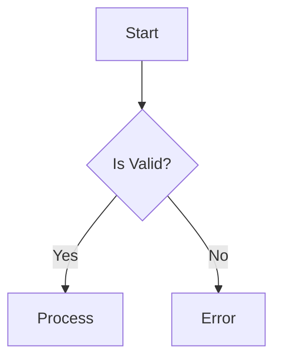
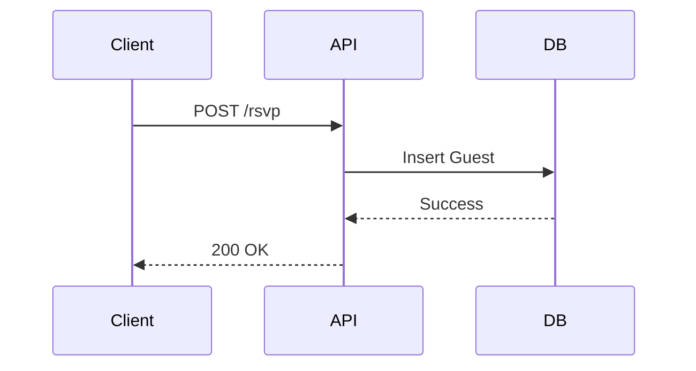

# Documentation Governance

> **Related skills**: [`backend-engineering`](../backend-engineering/SKILL.md) for documenting API
> patterns.

This skill governs the **lifecycle and structure of documentation**. Its primary goal is to prevent
"Documentation Drift" — the state where docs describe a system that no longer exists.

## Documentation Structure (`docs/`)

| Directory/File                     | Content Type                                                                             |
| :--------------------------------- | :--------------------------------------------------------------------------------------- |
| `docs/core/`                       | Evergreen architecture and cross-cutting policy docs.                                    |
| `docs/domains/`                    | Domain docs for RSVP, theme, assets, content, security, and similar bounded areas.       |
| `docs/architecture/`               | ADRs, architecture proposals, and evolution plans.                                       |
| `docs/audit/`                      | Audit reports, historical logs, and gap analyses.                                        |
| `docs/DOC_STATUS.md`               | **Source of Truth** for documentation health, active workflows, and active plans.        |
| `docs/audit/implementation-log.md` | Historical execution log. Legacy path references are allowed when explicitly historical. |

## Workflow Metadata Standards

All workflows in `.agent/workflows/*.md` **MUST** include YAML frontmatter:

```yaml
---
description: "Short description of what this workflow does"
lifecycle: "evergreen" | "task-open" | "task-completed"
domain: "governance" | "feature" | "remediation"
owner: "workflow-governance" | "system-agent" | "user"
last_reviewed: "YYYY-MM-DD"
---
```

## Anti-Drift Rules (The "Sync" Contract)

When modifying code, you **MUST** update the corresponding documentation in the same PR/Task.

1. **Business Logic Change**:
    - _If_ it changes the behavior described in an ADR or the Architecture doc.
    - _Action_: Update `docs/core/architecture.md`, the matching `docs/domains/**` doc, or create a
      new ADR under `docs/architecture/`.

2. **File Structure Change**:
    - _If_ moving core modules (e.g., `src/lib/rsvp` -> `src/lib/rsvp`).
    - _Action_: Update `docs/core/architecture.md` and any affected dashboard entry in
      `docs/DOC_STATUS.md`.

3. **New Feature**:
    - _Action_: Create the doc under the correct subtree (`docs/domains/` for feature docs,
      `docs/architecture/` for ADRs/proposals, `docs/audit/` for reports) and register it in
      `docs/DOC_STATUS.md` when it becomes an active source of truth.

## Diagram Standards

Use **Mermaid** for all diagrams. Embedded directly in markdown files.

### Flowchart (Logic Flow)



### Sequence (Interaction)



## Artifact Governance

When using Agent Mode artifacts (`task.md`, `implementation_plan.md`):

1. **task.md**: Keep it granular. Check off items as you go.
2. **implementation_plan.md**: The "Contract" before Execution. Do not deviate without updating it.
3. **walkthrough.md**: The "Proof". Must include what was tested.

## Verification Checklist

Before considering a documentation task "Done":

- [ ] Is the doc linked in `docs/DOC_STATUS.md`? (If new)
- [ ] Does it have a clear "Last Updated" date?
- [ ] Are code references (filenames, variable names) accurate to the current codebase?
- [ ] Is the doc stored in the correct subtree (`core`, `domains`, `architecture`, or `audit`)?
