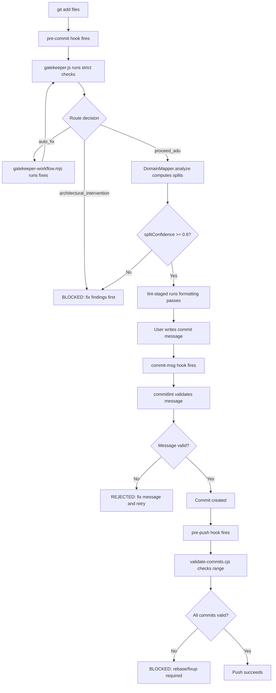

# Git Governance: High-Precision Commit Architecture

> **Status**: Active — enforced at `pre-commit`, `commit-msg`, and `pre-push` hooks. **Last
> Updated**: 2026-03-03

## Overview

This document is the **single source of truth** for the commit governance system in `celebra-me`. It
defines the ecosystem of scripts, configurations, and Git hooks that enforce professional-grade
traceability in the project's version history.

Every commit message in this repository is treated as **technical documentation**. Generic phrases
like "update files" or "fix stuff" are rejected at the hook level.

---

## Ecosystem Map

The governance system is composed of six interconnected components, each with a distinct
responsibility in the validation pipeline.

### Component Registry

| File                                                | Responsibility                                                                                                                                                                                                                                      | Hook / Trigger                            |
| --------------------------------------------------- | --------------------------------------------------------------------------------------------------------------------------------------------------------------------------------------------------------------------------------------------------- | ----------------------------------------- |
| `.agent/governance/bin/gatekeeper.js`               | Core validation engine: 15+ rules covering forbidden files, architecture boundaries, secret scanning, style/script policies, god-object detection, duplication guards, and language governance. Outputs a JSON report with a deterministic `route`. | `pre-commit`                              |
| `.agent/governance/bin/gatekeeper-workflow.mjs`     | Self-healing workflow orchestrator: reads the gatekeeper JSON report, extracts auto-fixable findings, executes fix commands in a retry loop (max 3 attempts), and re-validates.                                                                     | Manual via `pnpm gatekeeper:workflow`     |
| `.agent/governance/bin/gatekeeper-commit-ready.mjs` | Branch guard: prevents direct commits to `main`, offers `--create-branch` for new feature branches, then runs `gatekeeper:report`.                                                                                                                  | Manual via `pnpm gatekeeper:commit-ready` |
| `scripts/validate-commits.cjs`                      | Post-push ADU validator: iterates over a commit range (`base..head`), validates each commit against conventional-commit format, rejects merge commits and WIP markers, and enforces a max-12-files-per-commit atomicity rule.                       | `pre-push` / CI                           |
| `.agent/governance/config/domain-map.json`          | Domain boundary definitions: maps file globs to semantic domains (`invitation`, `auth`, `theme`, `governance`, `core`, `ui`, `docs`, `test`, `admin`). Used by `DomainMapper` to compute ADU splits and split confidence.                           | Read by `gatekeeper.js`                   |
| `commitlint.config.cjs`                             | Conventional Commit enforcement: type/scope validation, vague-subject rejection, English-only message enforcement, mandatory body with file-level bullets for multi-file commits, and minimum body length for complex changes.                      | `commit-msg`                              |
| `.agent/governance/config/policy.json`              | Governance thresholds: per-rule enablement, kill-switches, severity-by-phase escalation, documentation mapping triggers, architecture boundary imports, and auto-branching configuration.                                                           | Read by `gatekeeper.js`                   |
| `.agent/governance/config/baseline.json`            | Baseline suppressions: stable-key and legacy-fingerprint entries for known findings that are temporarily suppressed during phased rollout.                                                                                                          | Read by `gatekeeper.js`                   |

### npm Scripts

```text
pnpm gatekeeper              → Run gatekeeper.js (default: strict mode)
pnpm gatekeeper:report        → Full JSON report (governance + lint + typecheck + security + ADU)
pnpm gatekeeper:baseline      → Rebuild baseline.json from current codebase state
pnpm gatekeeper:workflow      → Self-healing loop (fix → re-validate × 3)
pnpm gatekeeper:commit-ready  → Branch guard + gatekeeper report
```

---

## The ADU Lifecycle

**ADU** (Atomic Domain Unit) is the principle that every commit must contain changes from exactly
one semantic domain. This ensures domain isolation, clean reverts, and readable history.

### Step-by-Step: Staging to Push



### DomainMapper Logic

1. **Input**: Array of staged file paths.
2. **Matching**: Each file is tested against glob patterns in `domain-map.json`.
3. **Grouping**: Files are grouped by their matched domain.
4. **Unmapped**: Files matching no pattern fall to `defaultDomain` ("core") and are flagged as
   `unmappedFiles`.
5. **Output**: `suggestedSplits` (array of `{ id, files }`), `unmappedFiles`, and `splitConfidence`
   (ratio of mapped files to total files).

### Split Confidence Thresholds

| Confidence  | Interpretation                   | Route                         |
| ----------- | -------------------------------- | ----------------------------- |
| `1.00`      | All files mapped to domains      | `proceed_adu`                 |
| `0.60–0.99` | Most files mapped; some unmapped | `proceed_adu` (with warnings) |
| `< 0.60`    | Too many unmapped files          | `architectural_intervention`  |

---

## Commit Message Standard of Excellence

### Anatomy of a Perfect Commit

```text
type(scope): concise technical intent in imperative mood

- path/to/file.ts: what was specifically changed and why
- path/to/other.scss: what was added/removed/modified
- path/to/config.json: exact nature of the configuration change

[optional footer: BREAKING CHANGE, issue ref, etc.]
```

### Subject Line Rules

| Rule                        | Enforcement               | Example                                                |
| --------------------------- | ------------------------- | ------------------------------------------------------ |
| Conventional type required  | `commitlint` type-enum    | `feat`, `fix`, `docs`, `refactor`, `chore`, etc.       |
| Scope required (kebab-case) | `commitlint` scope-case   | `(auth)`, `(theme-preset)`, `(governance)`             |
| No vague terms              | `no-vague-subject` plugin | ❌ "update", "fix stuff", "changes", "misc", "wip"     |
| English only                | `english-message` plugin  | ❌ Spanish words, accented characters                  |
| Max 72 characters           | `header-max-length`       | Enforced by commitlint                                 |
| Imperative mood             | Convention                | ✅ "add", "remove", "change" — ❌ "added", "adding"    |
| No trailing period          | `subject-full-stop`       | ❌ "add auth flow."                                    |
| Technical specificity       | Convention                | ✅ "add JWT refresh token rotation to auth middleware" |

### Banned Subject Patterns

The following regex is enforced by the `no-vague-subject` commitlint plugin:

```regex
/\b(wip|update|fix stuff|changes|misc|various|tmp|temp|quick fix|refactor scripts|minor
  changes|small fix|cleanup|tweaks|improvements|adjustments|stuff|things)\b/i
```

### Body Requirements

| Condition                              | Body Required? | Format             |
| -------------------------------------- | -------------- | ------------------ |
| Subject `length >= 50`                 | **Yes**        | Bulleted list      |
| Subject contains `and`, `with`, `plus` | **Yes**        | Bulleted list      |
| Commit touches `> 1` file              | **Yes**        | File-level bullets |
| Single-file, short subject             | Optional       | Free-form          |

**Body bullet format:**

```text
- relative/path/to/file.ext: precise technical description of the change
```

**Minimum body length**: 30 characters (when body is required).

### Examples: Good vs. Bad

#### ✅ Perfect Commit

```text
feat(auth): add JWT refresh token rotation to session middleware

- src/middleware.ts: add token-refresh logic using Supabase onAuthStateChange
- src/lib/rsvp/session.ts: extract refreshSession() helper with 5-min TTL check
- src/pages/api/auth/refresh.ts: new endpoint returning refreshed access_token
```

#### ✅ Perfect Single-File Commit

```text
fix(theme): correct HSL lightness calculation in rose-gold preset
```

#### ❌ Rejected: Vague Subject

```text
fix: update stuff
```

#### ❌ Rejected: Missing Body on Multi-File Commit

```text
refactor(auth): restructure authentication module
```

_(touches 4 files but provides no file-level detail)_

#### ❌ Rejected: Mixed Domains

```text
feat(core): add new event type and fix theme colors
```

_(mixes `core` and `theme` domains — must be 2 separate commits)_

---

## Domain Boundaries

### Current Domain Map

| Domain       | Glob Patterns                                                                                                                 | Typical Commit Scopes                           |
| ------------ | ----------------------------------------------------------------------------------------------------------------------------- | ----------------------------------------------- |
| `invitation` | `src/components/invitation/**`, `src/pages/[eventType]/**`, `src/layouts/Layout.astro`                                        | `invitation`, `layout`, `event-page`            |
| `auth`       | `src/lib/rsvp/**`, `src/pages/api/auth/**`, `src/pages/api/invitacion/**`, `src/middleware.ts`                                | `auth`, `rsvp`, `session`, `middleware`         |
| `theme`      | `src/styles/themes/**`, `src/styles/tokens/**`, `src/styles/*.scss`                                                           | `theme`, `theme-preset`, `tokens`, `typography` |
| `governance` | `.agent/**`, `.husky/**`, `.github/**`, `scripts/**`, `commitlint.config.cjs`, `package.json`, `pnpm-lock.yaml`, `.gitignore` | `governance`, `gatekeeper`, `ci`, `deps`        |
| `core`       | `src/content/config.ts`, `src/content/events/**`, `src/lib/adapters/**`, `src/lib/assets/**`, `src/data/**`                   | `core`, `content`, `adapter`, `data`            |
| `ui`         | `src/components/common/**`, `src/components/ui/**`, `src/components/home/**`, `src/components/layout/**`, `src/assets/**`     | `ui`, `component`, `icon`, `layout`             |
| `docs`       | `docs/**`                                                                                                                     | `docs`, `architecture`, `audit`                 |
| `test`       | `tests/**`, `**/*.test.*`, `**/*.spec.*`, `jest.config.*`                                                                     | `test`, `e2e`, `unit`                           |
| `admin`      | `src/pages/admin/**`, `src/components/admin/**`                                                                               | `admin`, `dashboard`, `crm`                     |

### ADU Violation Detection

When `DomainMapper.analyze()` returns `suggestedSplits` with more than one domain:

1. The route is still `proceed_adu` (splits are _suggested_, not enforced at gatekeeper level).
2. The **agent workflow** (`gatekeeper-commit.md`) MUST split the commit manually.
3. Use `git add -p` or `git reset HEAD <file>` to isolate files by domain.
4. Commit each domain separately with its own message.

---

## Gatekeeper Routes

The `computeRoute()` function in `gatekeeper.js` produces one of three deterministic routes:

| Route                        | Meaning                                             | Action                                         |
| ---------------------------- | --------------------------------------------------- | ---------------------------------------------- |
| `proceed_adu`                | All checks passed, ADU confidence is acceptable     | Proceed to commit using suggested splits       |
| `auto_fix`                   | No blocking findings, but auto-fixable issues exist | Run `pnpm gatekeeper:workflow` to apply fixes  |
| `architectural_intervention` | Blocking findings or split confidence < 0.6         | Manual intervention required before committing |

### Route Decision Logic

```javascript
if (hasBlockingFindings || splitConfidence < 0.6) → 'architectural_intervention'
else if (hasAutoFixableFindings)                  → 'auto_fix'
else                                               → 'proceed_adu'
```

---

## Governance Phases

Policy rules support phased severity escalation:

| Phase | Purpose                                             | Typical Severity                              |
| ----- | --------------------------------------------------- | --------------------------------------------- |
| **1** | Report-only for new governance rules                | `warn` for new rules, `block` for established |
| **2** | Block high-signal architecture and docs mappings    | Most rules escalate to `block`                |
| **3** | Full hardening including inline style/script policy | All rules at `block` severity                 |

Phase is configured via `policy.json → phaseDefaults.defaultPhase` or overridden at runtime with
`--enforce-phase <1|2|3>`.

---

## Commit Message Auto-Proposal

When an AI agent or developer uses the `gatekeeper:report` command, the JSON output includes an
`adu` section with `suggestedSplits`. The recommended workflow for generating commit messages:

### Algorithm

1. Run `pnpm gatekeeper:report` and parse the JSON output.
2. For each entry in `adu.suggestedSplits`: a. Determine the `type` from `classifyBranchPrefix()`
   logic (feat/fix/docs/style/chore). b. Use the domain `id` as the commit `scope`. c. Read
   `git diff --cached -- <files>` to extract the nature of changes. d. Compose the subject:
   `type(scope): <imperative description of primary change>`. e. Compose the body: one
   `- file: description` bullet per file.
3. Stage only the files for one split at a time.
4. Commit with the generated message.
5. Repeat for remaining splits.

### Commit Type Inference

| File Pattern                                   | Inferred Type |
| ---------------------------------------------- | ------------- |
| All files in `docs/` or `*.md`                 | `docs`        |
| All files in `tests/` or contain `.test.`      | `test`        |
| All files in `src/styles/` or `*.scss`/`*.css` | `style`       |
| All files in `scripts/` or `.agent/`           | `chore`       |
| Everything else                                | `feat`        |

---

## Configuration Reference

### commitlint.config.cjs

| Rule                            | Level   | Description                                                                         |
| ------------------------------- | ------- | ----------------------------------------------------------------------------------- |
| `type-enum`                     | error   | Restrict to: feat, fix, docs, style, refactor, perf, test, build, ci, chore, revert |
| `type-case`                     | error   | Must be lowercase                                                                   |
| `scope-case`                    | error   | Must be kebab-case                                                                  |
| `subject-empty`                 | error   | Subject line cannot be empty                                                        |
| `subject-full-stop`             | error   | No trailing period                                                                  |
| `header-max-length`             | error   | Max 72 characters                                                                   |
| `body-leading-blank`            | error   | Blank line between subject and body                                                 |
| `no-vague-subject`              | error   | Rejects vague terms (custom plugin)                                                 |
| `english-message`               | error   | Rejects Spanish words/accented chars (custom plugin)                                |
| `body-bullets-for-complex`      | error   | Complex commits require `- ...` bullet body (custom plugin)                         |
| `body-min-length-when-required` | error   | Body must be >= 30 chars when required (custom plugin)                              |
| `body-file-path-bullets`        | warning | Multi-file commits should have `- path: desc` bullets (custom plugin)               |

### policy.json Key Sections

| Section                  | Purpose                                                                   |
| ------------------------ | ------------------------------------------------------------------------- |
| `killSwitch`             | Global disable for all governance checks                                  |
| `maxFindings`            | Cap on total findings reported per run                                    |
| `phaseDefaults`          | Default enforcement phase (1-3)                                           |
| `rules.*`                | Per-rule configuration: enabled, killSwitch, maxFindings, severityByPhase |
| `docsEvidence`           | Requirements for documentation change evidence                            |
| `docMappings`            | Triggers that require companion documentation updates                     |
| `architectureBoundaries` | Client-side forbidden imports (server-only modules)                       |
| `autoBranching`          | Auto-switch from protected branches to feature branches                   |

---

## Troubleshooting

### Common Rejection Reasons

| Error                                               | Cause                                     | Fix                                        |
| --------------------------------------------------- | ----------------------------------------- | ------------------------------------------ |
| "commit subject is too vague"                       | Subject contains banned words             | Use specific technical language            |
| "commit message must be written in English"         | Spanish detected                          | Rewrite in English                         |
| "complex commits require a body with bullet points" | Long subject or conjunctions without body | Add `- file: description` bullets          |
| "body must be at least 30 characters"               | Body too short                            | Provide meaningful file-level descriptions |
| "Scope drift detected"                              | Staged files changed since S0 snapshot    | Re-run `pnpm gatekeeper:report`            |
| "Commit touches N files (max 12)"                   | Too many files in one commit              | Split into smaller atomic commits          |

### Useful Commands

```bash
# Check what domains your staged files belong to
pnpm gatekeeper:report 2>/dev/null | jq '.adu'

# View suggested commit splits
pnpm gatekeeper:report 2>/dev/null | jq '.adu.suggestedSplits'

# Check split confidence
pnpm gatekeeper:report 2>/dev/null | jq '.adu.splitConfidence'

# Rebuild baseline after acknowledged findings
pnpm gatekeeper:baseline
```

---

## The Governance Vault Architecture

The Governance Vault (`.agent/governance/`) is the central intelligence unit for maintaining the
integrity, naming standards, and documentation alignment of the `celebra-me` project. It
consolidates scattered scripts and configurations into a single, deterministic architecture.

| Path                        | Purpose                                                         |
| --------------------------- | --------------------------------------------------------------- |
| `.agent/governance/bin/`    | **The Brain**: Core scripts (`governance.js`, `gatekeeper.js`). |
| `.agent/governance/config/` | **The Law**: Policy, Baseline, and Domain Mapping.              |
| `.agent/governance/state/`  | **The Truth**: Current S0 Signature and system state.           |

### The Governance Micro-CLI (`governance.js`)

A lean, high-performance tool for audit and signing.

| Command                     | Action                                                                            |
| --------------------------- | --------------------------------------------------------------------------------- |
| `pnpm governance audit`     | Runs full naming convention and intent drift checks.                              |
| `pnpm governance sign-s0`   | Generates a new `system-s0.json` signature based on all tracked files.            |
| `pnpm governance drift`     | Specifically checks for broken file references in documentation.                  |
| `pnpm governance verify-s0` | Verifies the current state against the stored signature (enforced by Gatekeeper). |

### S0 Signature Integrity

Every file's SHA-1 is included in a global payload, which is then hashed (SHA-256). This creates a
deterministic "fingerprint" of the entire repository. If the fingerprint changes without a re-sign,
the Gatekeeper blocks the commit.

> [!CAUTION] Never manually edit `system-s0.json`. Always use the `sign-s0` command to ensure the
> signature is mathematically correct.

---

> [!IMPORTANT] This document must be updated whenever changes are made to any governance script,
> commitlint configuration, or domain-map. The `documentationMappings` rule in `policy.json` will
> flag stale documentation automatically.
