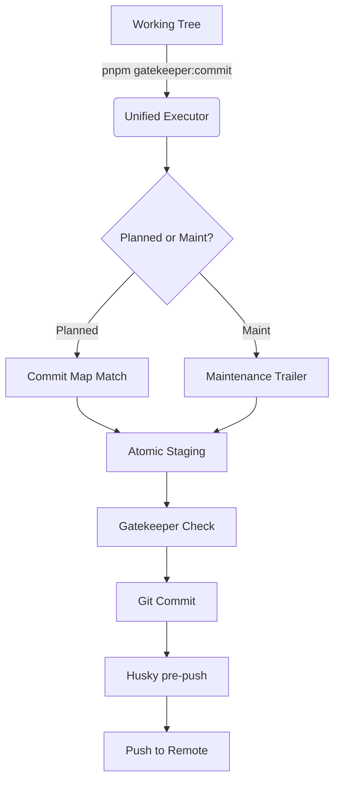

# Git Governance: Lean Commit Execution

**Status:** Active  
**Last Updated:** 2026-03-23  
**Change Note:** Lean Governance 2.0 overhaul. Unified commit commands, introduced Maintenance Mode, and recursive plan resolution.

## Overview

This document defines executable ownership for the Lean Gatekeeper commit workflow.

Commit intent is primary. Execution and validation layers automate the process of adhering to that intent while reducing operational friction and token consumption.

## Ownership

| Owner                                            | Responsibility                                            |
| ------------------------------------------------ | --------------------------------------------------------- |
| `.agent/plans/README.md`                         | Contract for executable plans and `commit-map.json`       |
| `.agent/governance/bin/validate-commit-plan.mjs` | Machine validation of active plan commit maps             |
| `.agent/governance/bin/gatekeeper-workflow.mjs`  | Unified commit execution (inspect + stage + commit)       |
| `commitlint.config.cjs`                          | Message validation (Planned or Maintenance)               |
| `scripts/validate-commits.mjs`                   | Range validation from commit trailers                     |
| `.husky/pre-commit`                              | Lint-staged, quality enforcement                          |
| `.husky/pre-push`                                | Smart range validation and tests                         |

## Primary Commands

```text
pnpm gatekeeper:plans:doctor -- --plan <plan-id>
pnpm gatekeeper:commit -- --plan <plan-id> [--unit <unit-id>]
pnpm gatekeeper:commit -- --maintenance
pnpm gatekeeper:workflow:cleanup
```

## Validation Sequence

1. `pnpm lint` stabilizes code quality.
2. `gatekeeper:plans:doctor` verifies lifecycle readiness and coverage.
3. `gatekeeper:commit` resolves the unit, stages it, and commits it in one atomic step.
4. `pre-push` validates the push range against trailers and runs tests.

## Maintenance Mode (Unplanned)

Small, high-quality fixes (chore, docs, fix) can be committed without a formal plan by adding the following trailer to the commit body:

```text
Maintenance: true
```

These commits still undergo full linting, type-checking, and conventional commit validation but skip the plan-unit matching requirement.

## Guarantees

- Commit intent is derived from the approved `commit-map.json`.
- Units are atomic; `gatekeeper:commit` ensures no partial or over-staged leaks.
- Smart range validation in `pre-push` handles feature branches and re-validation efficiently.
- Metadata is strictly enforced for planned work, but soft lifecycle rules allow historical review.

## Architecture


