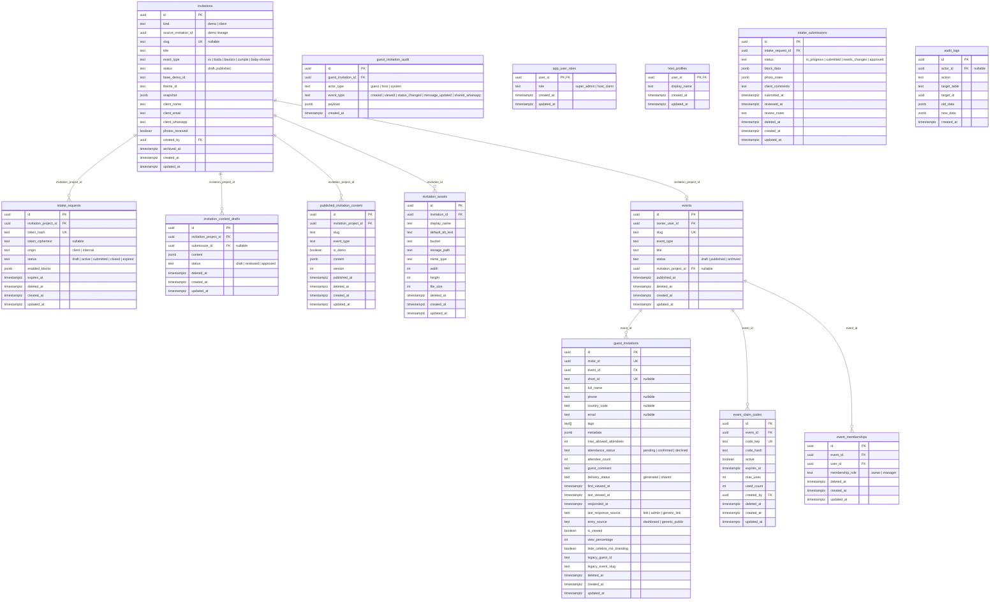

# Database Overview

**Last Updated:** 2026-07-25

**Owns:** current Supabase/Postgres schema overview, entity relationships, and major data flows.

**Does not own:** migration/ops procedures — those live in
[`docs/database-workflow.md`](../../database-workflow.md). Content promote/mirror vs RSVP isolation
lives in
[`docs/core/content-parity-rsvp-isolation.md`](../../core/content-parity-rsvp-isolation.md). See the
Ownership Matrix in [`.agent/ownership.yaml`](../../../.agent/ownership.yaml).

This document describes the current Celebra-me Supabase/Postgres schema, entity relationships, and
major data flows.

## ERD (Entity Relationship Diagram)

## Major Data Flows

### Invitation Creation

Managed client invitations are created only through the definition registry +
`pnpm invitation:release` (Local/Preview). Owner Production apply is
`pnpm prod:apply -- --slug <slug> --apply`. `POST /api/dashboard/intake` and Dashboard duplicate
reject client creation (`403`). Demo rows are synchronized by `synchronizeDemoInvitations`, not by
Dashboard create.

### Internal Admin Editing

Admin opens `/dashboard/invitaciones/[id]/editar` → reads `invitations`, creates/reads
`intake_requests(origin=internal)`, creates/reads `intake_submissions`. Data flows:
`intake_submissions.block_data` → `invitation_content_drafts.content` via draft generation.

### Optional Client Capture (Capture Link)

Admin generates capture link → creates `intake_requests(origin=client)` with `token_hash` +
encrypted `token_ciphertext` → client visits `/captura/[token]` → reads/writes `intake_submissions`
→ admin reviews.

### Publishing

Admin clicks "Publicar" → `publishDraft()` service:

1. Reads draft from `invitation_content_drafts`
2. Maps draft content via `mapDraftToPublished()`
3. If `kind=client`: creates/updates `events` row (RSVP sync)
4. Upserts `published_invitation_content` (one row per `(event_type, slug)`)
5. Updates `invitations.status = 'published'`
6. Updates `invitation_content_drafts.status = 'approved'`

### Public Route Resolution (Content Serving)

Visitor → `/{eventType}/{slug}` → `resolveInvitationContent()`:

1. Tries `published_invitation_content` lookup via `(event_type, slug)`
2. Falls back to static Astro content collection for demo entries
3. Non-demo static entries are explicitly blocked (must come from DB)

### Asset Library

Admin uploads through `/api/dashboard/intake/[id]/assets/**` create `invitation_assets` metadata
rows for a specific invitation. In Local (`dev-local`), binaries are stored in Supabase Storage local
(`invitation-assets` bucket); in Preview and Production, binaries are hosted on Cloudinary with SHA-256
deduplication. Postgres stores provider, display names, alt text, object paths, MIME type, size,
dimensions, secure URLs, and soft-delete state.

### RSVP Linkage

When a client invitation is published, `synchronizeClientRsvp()` checks for an existing `events` row
by `invitation_project_id` or `slug`. Creates or updates the event. The partial unique index
`idx_events_unique_invitation_project` enforces at most one event per project.

### Archive / Restore

Admin clicks "Archivar" → `archive_invitation()` RPC:

- Sets `invitations.archived_at = now()`
- Soft-deletes `published_invitation_content`, `invitation_content_drafts`, `intake_submissions`,
  `intake_requests`, `events`
- Records `audit_logs` entry

Admin clicks "Restaurar" → `restore_invitation()` RPC:

- Clears `archived_at`
- Restores all soft-deleted children
- Restores event status to 'published' if published content exists

### Client creation and duplication (Dashboard)

Dashboard HTTP create and duplicate are rejected. Client invitations are provisioned only through
canonical/internal managed workflows (definition registry + provision CLIs), not Dashboard UI/API:

| Surface                                         | Behavior                                                                               |
| ----------------------------------------------- | -------------------------------------------------------------------------------------- |
| `POST /api/dashboard/invitation`                | 403 `canonical_creation_required` (`via: 'create'`)                                    |
| `POST /api/dashboard/invitation/[id]/duplicate` | 403 `canonical_creation_required` (`via: 'duplicate'`)                                 |
| Managed create / Preview E2E fixture            | Canonical scripts (`invitation:release`, `invitation:preview-fixture`, import engines) |

`duplicateInvitationFromDemo()` may still exist as an internal service primitive, but it is not an
active Dashboard workflow and must not be invoked for managed client creation.

## Index Strategy

| Table                          | Index                                                 | Purpose                                    |
| ------------------------------ | ----------------------------------------------------- | ------------------------------------------ |
| `invitations`                  | `idx_invitations_archived_at`                         | Active row filtering                       |
| `events`                       | `idx_events_deleted_at`                               | Active row filtering                       |
| `events`                       | `idx_events_unique_invitation_project`                | 1:1 enforcement                            |
| `events`                       | `idx_events_invitation_project_id`                    | FK lookup                                  |
| `guest_invitations`            | `guest_invitations_event_country_phone_active_unique` | Unique (event, country, phone) active only |
| `published_invitation_content` | `published_invitation_content_event_type_slug_key`    | UNIQUE constraint for route key            |
| `intake_requests`              | `idx_intake_requests_token_hash`                      | Token lookup                               |
| `intake_requests`              | `idx_intake_requests_project_origin_created`          | Dashboard listing                          |
| `invitation_assets`            | `idx_invitation_assets_storage_path`                  | Immutable Storage object path uniqueness   |
| `invitation_assets`            | `idx_invitation_assets_invitation`                    | Active assets per invitation               |

## Key Constraints

- `published_invitation_content`: UNIQUE `(event_type, slug)` — route identity
- `guest_invitations`: Partial UNIQUE INDEX
  `(event_id, country_code, phone) WHERE deleted_at IS NULL`
- `events`: Partial UNIQUE INDEX `(invitation_project_id) WHERE invitation_project_id IS NOT NULL`
- `invitations.slug`: UNIQUE (nullable — only set for published invitations)
- `invitation_assets`: UNIQUE `(bucket, storage_path)` — Storage paths are never reused
- `intake_submissions`: Partial UNIQUE INDEX `(intake_request_id)` — exactly one submission per
  request

## Security Model

- **RLS enabled** on all application tables
- **SECURITY DEFINER functions** hardened with `set search_path = 'public'` (migration 37)
- **Server-side service_role**: All repository methods use `useServiceRole: true` to bypass RLS.
  This is a documented tradeoff: defense-in-depth relies on server-side auth checks, not RLS.
- **Public read access**: Only `published_invitation_content` has a public RLS select policy.
- **Admin-only access**: `invitations`, `intake_*`, drafts are locked to `is_admin_user()`.
- **Service-role only**: `audit_logs`, `deleted_*` views, archive/restore RPCs.
- **Asset metadata**: `invitation_assets` is managed by service-role API routes; uploaded files live
  in Supabase Storage.

## Migration Strategy

Do not freeze a migration count in active documentation. Production owner apply is
`pnpm prod:apply -- --schema --apply` (schema primitive: `pnpm db:migrate -- --target production`).
Hosted state must be read through `pnpm db:prod:audit`.

**For persistent-local**: use `pnpm db:migrate -- --target local` (preflight-first), then explicit
`--apply` after review. Then run `pnpm db:local:validate`. To import production-shaped data, use the
non-destructive backup and restore workflow in `docs/database-workflow.md`.

**For destructive reconstruction tests**: use `pnpm db:disposable:reset`. It targets the isolated
disposable database, never persistent-local. Full reset applies migrations via the shared disposable
migrate policy; truncated `--baseline` / `--max-version` remain disposable-only.

**For Preview**: use `pnpm db:migrate -- --target preview` with the exact Preview project perimeter
and clean-HEAD release identity.

**For production**: never rewrite, delete, or squash already-applied migrations. Always add
corrective migrations. Migration history is append-only. Do not push local data dumps to production;
use `pnpm prod:apply -- --schema --apply`. Hosted candidates require an explicit rollout registry
phase.

**Fresh bootstrap**: A `supabase/baseline.sql` schema dump can be generated via
`supabase db dump --schema public > supabase/baseline.sql` for environments that should not replay
the full migration history. Never freeze hosted applied/pending counts in docs — read live audits.

For refreshes, backups, and production migration operations, see `docs/database-workflow.md`.
