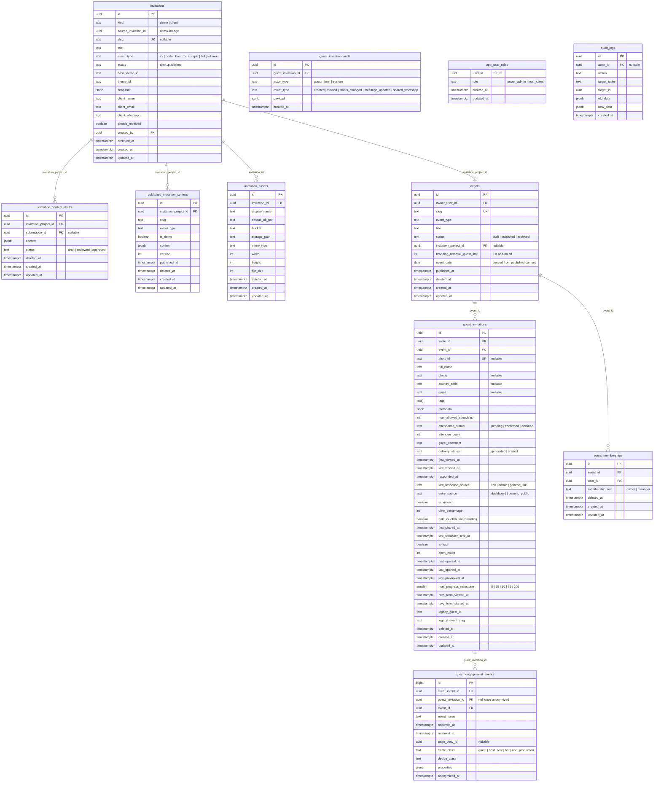

# Database Overview

**Last Updated:** 2026-10-09

**Owns:** current Supabase/Postgres schema overview, entity relationships, and major data flows.

**Does not own:** migration/ops procedures — those live in
[`docs/database-workflow.md`](../../database-workflow.md). Content promote/mirror vs RSVP isolation
lives in
[`docs/core/content-parity-rsvp-isolation.md`](../../core/content-parity-rsvp-isolation.md). See the
Ownership Matrix in [`.agent/ownership.yaml`](../../../.agent/ownership.yaml).

This document describes the current Celebra-me Supabase/Postgres schema, entity relationships, and
major data flows.

## ERD (Entity Relationship Diagram)

```mermaid
erDiagram
    invitations ||--o{ invitation_content_drafts : "invitation_project_id"
    invitations ||--o{ published_invitation_content : "invitation_project_id"
    invitations ||--o{ invitation_assets : "invitation_id"
    invitations ||--o| events : "invitation_project_id"
    invitations {
        uuid id PK
        text kind "demo | client"
        uuid source_invitation_id "demo lineage"
        text slug UK "nullable"
        text title
        text event_type "xv | boda | bautizo | cumple | baby-shower"
        text status "draft..published"
        text base_demo_id
        text theme_id
        jsonb snapshot
        text client_name
        text client_email
        text client_whatsapp
        boolean photos_received
        uuid created_by FK
        timestamptz archived_at
        timestamptz created_at
        timestamptz updated_at
    }

    events ||--o{ guest_invitations : event_id
    events ||--o{ event_memberships : event_id
    events {
        uuid id PK
        uuid owner_user_id FK
        text slug UK
        text event_type
        text title
        text status "draft | published | archived"
        uuid invitation_project_id FK "nullable"
        int branding_removal_guest_limit "0 = add-on off"
        date event_date "derived from published content"
        timestamptz published_at
        timestamptz deleted_at
        timestamptz created_at
        timestamptz updated_at
    }

    guest_invitations {
        uuid id PK
        uuid invite_id UK
        uuid event_id FK
        text short_id UK "nullable"
        text full_name
        text phone "nullable"
        text country_code "nullable"
        text email "nullable"
        text[] tags
        jsonb metadata
        int max_allowed_attendees
        text attendance_status "pending | confirmed | declined"
        int attendee_count
        text guest_comment
        text delivery_status "generated | shared"
        timestamptz first_viewed_at
        timestamptz last_viewed_at
        timestamptz responded_at
        text last_response_source "link | admin | generic_link"
        text entry_source "dashboard | generic_public"
        boolean is_viewed
        int view_percentage
        boolean hide_celebra_me_branding
        timestamptz first_shared_at
        timestamptz last_reminder_sent_at
        boolean is_test
        int open_count
        timestamptz first_opened_at
        timestamptz last_opened_at
        timestamptz last_previewed_at
        smallint max_progress_milestone "0 | 25 | 50 | 75 | 100"
        timestamptz rsvp_form_viewed_at
        timestamptz rsvp_form_started_at
        text legacy_guest_id
        text legacy_event_slug
        timestamptz deleted_at
        timestamptz created_at
        timestamptz updated_at
    }

    guest_invitations ||--o{ guest_engagement_events : guest_invitation_id
    guest_engagement_events {
        bigint id PK
        uuid client_event_id UK
        uuid guest_invitation_id FK "null once anonymized"
        uuid event_id FK
        text event_name
        timestamptz occurred_at
        timestamptz received_at
        uuid page_view_id "nullable"
        text traffic_class "guest | host | test | bot | non_production"
        text device_class
        jsonb properties
        timestamptz anonymized_at
    }

    guest_invitation_audit {
        uuid id PK
        uuid guest_invitation_id FK
        text actor_type "guest | host | system"
        text event_type "created | viewed | status_changed | message_updated | shared_whatsapp"
        jsonb payload
        timestamptz created_at
    }

    event_memberships {
        uuid id PK
        uuid event_id FK
        uuid user_id FK
        text membership_role "owner | manager"
        timestamptz deleted_at
        timestamptz created_at
        timestamptz updated_at
    }

    app_user_roles {
        uuid user_id PK, FK
        text role "super_admin | host_client"
        timestamptz created_at
        timestamptz updated_at
    }

    invitation_content_drafts {
        uuid id PK
        uuid invitation_project_id FK
        uuid submission_id FK "nullable"
        jsonb content
        text status "draft | reviewed | approved"
        timestamptz deleted_at
        timestamptz created_at
        timestamptz updated_at
    }

    published_invitation_content {
        uuid id PK
        uuid invitation_project_id FK
        text slug
        text event_type
        boolean is_demo
        jsonb content
        int version
        timestamptz published_at
        timestamptz deleted_at
        timestamptz created_at
        timestamptz updated_at
    }

    invitation_assets {
        uuid id PK
        uuid invitation_id FK
        text display_name
        text default_alt_text
        text bucket
        text storage_path
        text mime_type
        int width
        int height
        int file_size
        timestamptz deleted_at
        timestamptz created_at
        timestamptz updated_at
    }

    audit_logs {
        uuid id PK
        uuid actor_id FK "nullable"
        text action
        text target_table
        uuid target_id
        jsonb old_data
        jsonb new_data
        timestamptz created_at
    }
```

## Major Data Flows

### Invitation Creation

Managed client invitations are created only through the definition registry +
`pnpm invitation:release` (Local/Preview). Owner Production apply is
`pnpm prod:apply -- --slug <slug> --apply`. The Dashboard has no create or duplicate endpoint, and
it lists and edits only `kind = 'client'` rows. Demos are versioned content
(`src/content/event-demos/**`) rendered from Git; they are not mirrored into the database, and no
service copies a demo into a client record.

### Internal Admin Editing

Admin opens `/dashboard/invitaciones/[id]/editar` → the invitation editor reads `invitations`,
`invitation_content_drafts` and `published_invitation_content` and saves section changes to the
draft. There is no client capture form; content comes from managed definitions and the editor.

### Publishing

Admin clicks "Publicar" → `publishDraft()` service:

1. Reads draft from `invitation_content_drafts`
2. Maps draft content via `mapDraftToPublished()`
3. If `kind=client`: creates/updates `events` row (RSVP sync)
4. Upserts `published_invitation_content` (one row per `(event_type, slug)`)
5. Updates `invitations.status = 'published'`
6. Updates `invitation_content_drafts.status = 'approved'`

### Public Route Resolution (Content Serving)

Visitor → `/{eventType}/{slug}` → `resolveInvitationContent()`:

1. Tries `published_invitation_content` lookup via `(event_type, slug)`
2. Falls back to static Astro content collection for demo entries
3. Non-demo static entries are explicitly blocked (must come from DB)

### Asset Library

Admin uploads through `/api/dashboard/intake/[id]/assets/**` create `invitation_assets` metadata
rows for a specific invitation. In Local (`dev-local`), binaries are stored in Supabase Storage
local (`invitation-assets` bucket); in Preview and Production, binaries are hosted on Cloudinary
with SHA-256 deduplication. Postgres stores provider, display names, alt text, object paths, MIME
type, size, dimensions, secure URLs, and soft-delete state.

### RSVP Linkage

When a client invitation is published, the atomic publication RPC (`publish_invitation_atomic()`)
locks the `events` row linked by `invitation_project_id` or matching `slug`, then updates it or
creates one. The partial unique index `idx_events_unique_invitation_project` enforces at most one
event per project.

### Event Memberships

`event_memberships` links a host account to an event (one row per `event_id` + `user_id`, soft
deleted). `membership_role` is `owner` (visible as "Anfitrión principal") or `manager`
("Colaborador"). Both manage guests; only `owner` opens the guest memories organizer. The
administrator creates every host and membership. In `/dashboard/usuarios` the administrator picks
the role when assigning an event (default `owner`) and can change it in place; assigning an event
the user already holds updates the role and is audited as `change_event_membership_role` with the
previous row. The membership API still defaults to `manager` when a caller omits the role.

### Guest Memories

Guest photo/video spaces live in `event_memory_settings` (one per event; window, retention, quotas,
entitlement), `event_memory_sessions`, `event_memory_items`, and `event_memory_audit_events`
(`supabase/migrations/*event_memor*`). The client-named `valentina_memory_*` catalog is retired by
`20261009230200_retire_valentina_memories.sql`. Behavior, Workers, and quotas are owned by
[`docs/core/architecture.md`](../../core/architecture.md) (Event memories).

### Archive / Restore

Admin clicks "Archivar" → `archive_invitation()` RPC:

- Sets `invitations.archived_at = now()`
- Soft-deletes `published_invitation_content`, `invitation_content_drafts` and `events`
- Records `audit_logs` entry

Admin clicks "Restaurar" → `restore_invitation()` RPC:

- Clears `archived_at`
- Restores all soft-deleted children
- Restores event status to 'published' if published content exists

## Index Strategy

| Table                          | Index                                                 | Purpose                                    |
| ------------------------------ | ----------------------------------------------------- | ------------------------------------------ |
| `invitations`                  | `idx_invitations_archived_at`                         | Active row filtering                       |
| `events`                       | `idx_events_deleted_at`                               | Active row filtering                       |
| `events`                       | `idx_events_unique_invitation_project`                | 1:1 enforcement                            |
| `events`                       | `idx_events_invitation_project_id`                    | FK lookup                                  |
| `guest_invitations`            | `guest_invitations_event_country_phone_active_unique` | Unique (event, country, phone) active only |
| `published_invitation_content` | `published_invitation_content_event_type_slug_key`    | UNIQUE constraint for route key            |
| `invitation_assets`            | `idx_invitation_assets_storage_path`                  | Immutable Storage object path uniqueness   |
| `invitation_assets`            | `idx_invitation_assets_invitation`                    | Active assets per invitation               |

## Key Constraints

- `published_invitation_content`: UNIQUE `(event_type, slug)` — route identity
- `guest_invitations`: Partial UNIQUE INDEX
  `(event_id, country_code, phone) WHERE deleted_at IS NULL`
- `events`: Partial UNIQUE INDEX `(invitation_project_id) WHERE invitation_project_id IS NOT NULL`
- `invitations.slug`: UNIQUE (nullable — only set for published invitations)
- `invitation_assets`: UNIQUE `(bucket, storage_path)` — Storage paths are never reused

## Security Model

- **RLS enabled** on all application tables
- **SECURITY DEFINER functions** hardened with `set search_path = 'public'`
  (`20260601000002_corrective_security.sql`)
- **Host-scoped RLS for dashboard RSVP**: dashboard guest and event reads and edits send the host's
  JWT and are authorized by RLS. Privileged guest writes (bulk import, public RSVP, soft delete) run
  through service-role-only RPCs after BFF authorization; direct service-role guest DML is revoked.
  See `docs/domains/rsvp/database.md`.
- **Server-side service_role**: other server-only repositories (invitations, intake, assets) use
  `useServiceRole: true` behind server-side auth checks.
- **Public read access**: Only `published_invitation_content` has a public RLS select policy.
- **Admin-only access**: `invitations`, `intake_*`, drafts are locked to `is_admin_user()`.
- **Service-role only**: `audit_logs`, `deleted_*` views, archive/restore RPCs.
- **Asset metadata**: `invitation_assets` is managed by service-role API routes; binaries live in
  Supabase Storage locally and on Cloudinary in Preview/Production (see Asset Library above).

## Migration Strategy

Do not freeze a migration count in active documentation. Production owner apply is
`pnpm prod:apply -- --schema --apply` (schema primitive: `pnpm db:migrate -- --target production`).
Hosted state must be read through `pnpm db:prod:audit`.

**For persistent-local**: use `pnpm db:migrate -- --target local` (preflight-first), then explicit
`--apply` after review. Then run `pnpm db:local:validate`. To import production-shaped data, use the
non-destructive backup and restore workflow in `docs/database-workflow.md`.

**For destructive reconstruction tests**: use `pnpm db:disposable:reset`. It targets the isolated
disposable database, never persistent-local. Full reset applies migrations via the shared disposable
migrate policy; truncated `--baseline` / `--max-version` remain disposable-only.

**For Preview**: use `pnpm db:migrate -- --target preview` with the exact Preview project perimeter
and clean-HEAD release identity.

**For production**: never rewrite, delete, or squash already-applied migrations. Always add
corrective migrations. Migration history is append-only. Do not push local data dumps to production;
use `pnpm prod:apply -- --schema --apply`. Hosted candidates require an explicit rollout registry
phase.

For refreshes, backups, and production migration operations, see `docs/database-workflow.md`.
